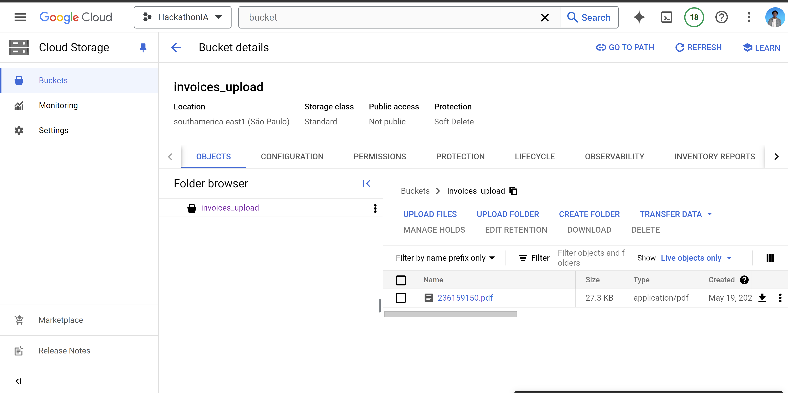
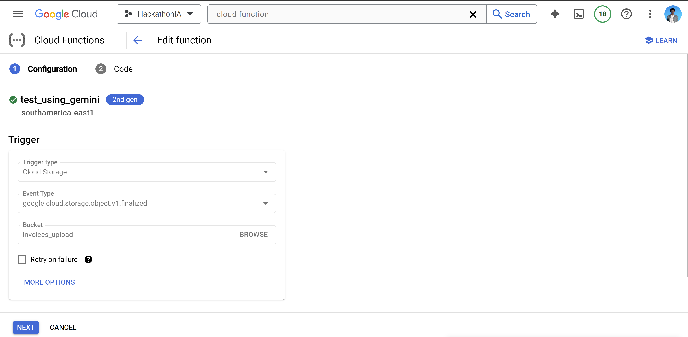
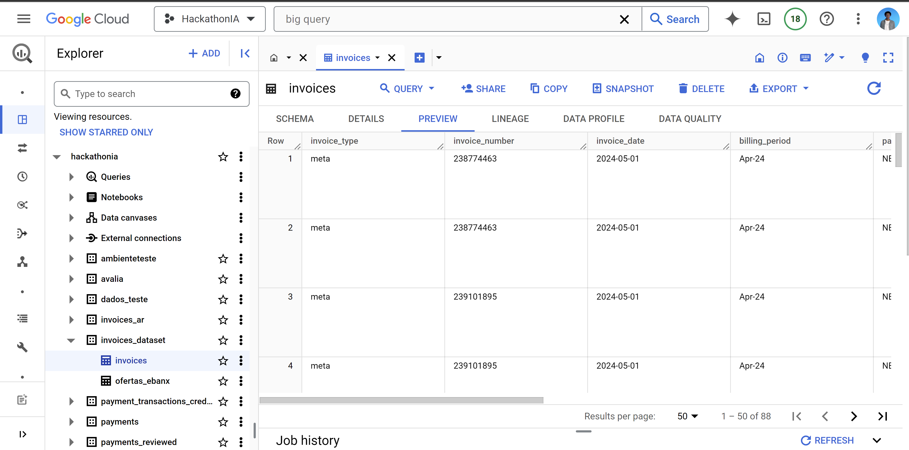
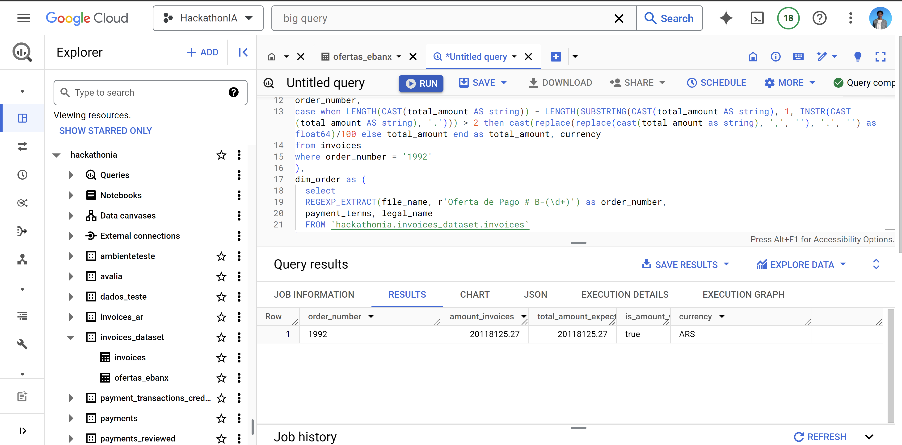

# HACKATON 2024
## Project developed at Hackaton 2024 at Ebanx
#### In this project, we developed a system using the tools on console.cloud.google.com to extract data from PDFs, specifically invoices, which do not follow a standard format, transform them into structured data and upload it to Big Query using AI. 

Creating a bucket to upload PDFs to the Cloud Storege

Once uploaded, the Cloud Function is triggered and executed.

The Cloud Function runs the Gemini prompt, which extracts the data from the PDF and transforms it into JSON. The structured data is then sent to BigQuery

With the data in BigQuery, we were able to compare it with the data in a spreadsheet and check that the values of the invoices matched by running the following query:

<pre>
  <code>
      with invoices as(
        select distinct file_name,
        legal_name,
        total_amount,
        currency,
        REGEXP_EXTRACT(file_name, r'Oferta de Pago # B-(\d+)') as order_number
        FROM `hackathonia.invoices_dataset.invoices`
      )
      ,amount_adjustments as (
      select distinct
      file_name,
      order_number,
      case when LENGTH(CAST(total_amount AS string)) - LENGTH(SUBSTRING(CAST(total_amount AS string), 1, INSTR(CAST(total_amount AS string), '.'))) > 2 then cast(replace(replace(cast(total_amount as string), ',', ''), '.', '') as float64)/100 else total_amount end as total_amount, currency
      from invoices
      where order_number = '1992'
      ),
      dim_order as (
        select
        REGEXP_EXTRACT(file_name, r'Oferta de Pago # B-(\d+)') as order_number,
        payment_terms, legal_name
        FROM `hackathonia.invoices_dataset.invoices`
      ),
      invoices_grouped as (
      select 
      ad.order_number, 
      round(sum(total_amount), 2) as amount_invoices,
      currency
      from amount_adjustments as ad
      group by 1, 3),
      amount_expected as (
        select 
        right(Oferta_Relacionada, 4) as order_number,
        round(Total_Amount_of_Invoices, 2) as total_amount_expected
        from `hackathonia.invoices_dataset.ofertas_ebanx`
        --where right(Oferta_Relacionada, 4) = '1992'
      )
      select ig.order_number,ig.amount_invoices, ae.total_amount_expected, case when ig.amount_invoices = ae.total_amount_expected then true else false end as is_amount_valid, ig.currency
      from invoices_grouped as ig
      left join amount_expected as ae on ae.order_number = ig.order_number;
 </code>
</pre>

